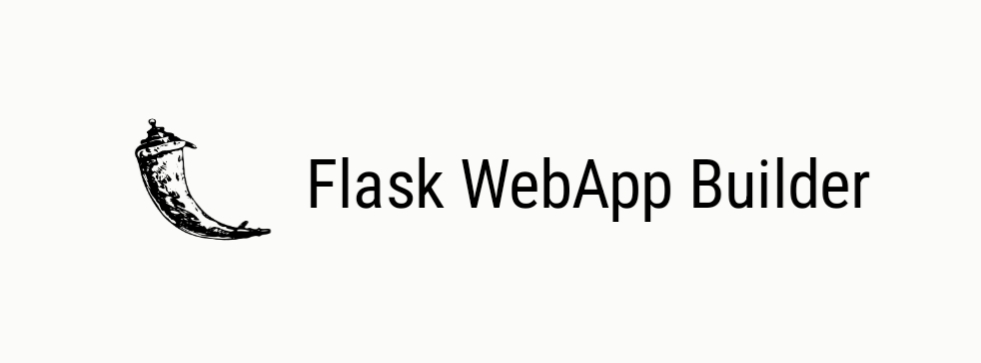
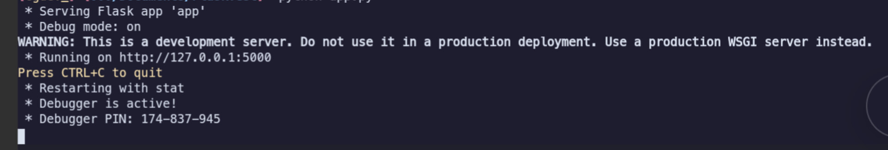

<h1>Flask WebApp Builder</h1>



The **Flask WebApp Builder** is a python package designed to streamline the setup of a new Flask web application. It automates the creation of a basic Flask project structure, making it easier for developers to get started with their web development projects.

## Overview

**Flask WebApp Builder** sets up a new flask project with a predefined directory structure. Including essential files and directories required for a basic web application. This tool is particularly useful for developers who want to quickly create a flask application without manually setting up the project layout.

## Features

- **Automated Project Setup**: Quickly generates a complete flask project structure with a single [command](#installation).
- **Sample Files**: Includes sample static files such as images and fonts to demonstrate how to use flask’s static file serving capabilities.
- **Basic Application File**: Provides a default `app.py` file that sets up a basic flask application with a single route.
- **Static and Templates Directories**: Creates `static` and `templates` directories with sample content, including CSS, JavaScript, and HTML files.
- **Customizable**: Easily modify the generated files to fit your project's needs.

## installation

> install flask webapp builder with pip.

CLI:

```bash
  pip install flask-webapp-builder
```

```bash
  pip install https://github.com/christiangarcia0311/flask-webapp-builder/raw/main/dist/flask_webapp_builder-1.2.0.tar.gz
```

## Usage

1. Create new flask project.

> Replace [project name] with the desired name of your project directory. For example `my_flask_app`.

```bash
build-flask-webapp [project name]
```

2. Navigate project directory.

> Change into the newly created project directory to modify and generates file depends on your project needs.

```bash
cd [projectname]
```

3. Run the flask application

> To start the flask development server use the provided `run-server` script.

```bash
python run-server
```

or 

```bash
./run-server
```

4. Access flask aplication

> Open browser and go to `http://127.0.0.1:5000`  to see your flask application running.



5. Edit and Customize file

> Feel free to edit the `index.html`, `main.css`, `main.js` and other files to customize your application according to your needs.

## Development 

To contribute to this project clone the repository:

```bash
git clone https://github.com/christiangarcia0311/flask-webapp-builder.git
cd flask-webapp-builder
```

## License


## Acknowledgements

[Flask Framework](https://flask.palletsprojects.com/en/3.0.x/): web framework used to build the project.

[Christian Garcia](https://github.com/christiangarcia0311): creator and maintainer of this package.
